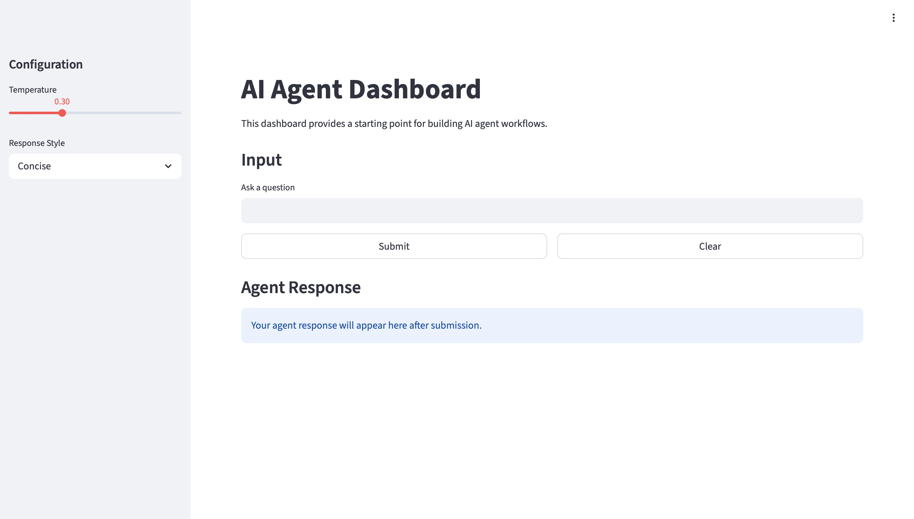

# AI Agent Dashboard

## System Overview
This project is a simple Streamlit dashboard (`app.py`) that lets a user enter a question and get a simulated “AI agent” response.

The actual response logic lives in `agent.py`, where `process(user_input, temperature=0.3, response_style="Concise")`:
- Calls DeepSeek using an OpenAI-compatible client (`base_url="https://api.deepseek.com/v1"`)
- Falls back to a local simulation when `DEEPSEEK_API_KEY` is not configured or if the API call fails

## How to Run the App
1. Install dependencies:
   - `pip install -r requirements.txt`
2. Configure your environment variables:
   - Create a `.env` file in the project root with:
     - `DEEPSEEK_API_KEY=your-actual-deepseek-api-key-here`
3. Start Streamlit:
   - `streamlit run app.py`
4. Open the shown local URL in your browser.

## Features Implemented
- Wide layout Streamlit page titled `AI Agent Dashboard`
- Sidebar configuration with:
  - Temperature slider (0.0 to 1.0, default 0.3)
  - Response Style dropdown (`Concise`, `Detailed`, `Humorous`)
- Main area with:
  - User question input
  - Submit button
  - Clear button (resets input and response)
  - Loading spinner during processing
  - Display of the agent response in the UI
- Agent-side behavior:
  - Empty input validation
  - Error handling (graceful fallback on API errors)
  - Response style included via the DeepSeek system message

## Design Decisions
- **Streamlit session state**: Used to persist the last response and to implement the `Clear` button cleanly.
- **API compatibility**: Uses the `openai` Python client with `base_url="https://api.deepseek.com/v1"` to work with DeepSeek’s OpenAI-compatible API.
- **Fail-safe fallback**: If `DEEPSEEK_API_KEY` is missing (or the API call fails), the dashboard still works using local simulated responses.
- **Separation of concerns**: UI code is kept in `app.py`, while agent behavior is isolated in `agent.py`.

## Screenshot
<!-- TODO: Capture a screenshot manually and save it as `screenshot.png` in this project folder. -->
<!-- Example:  -->

